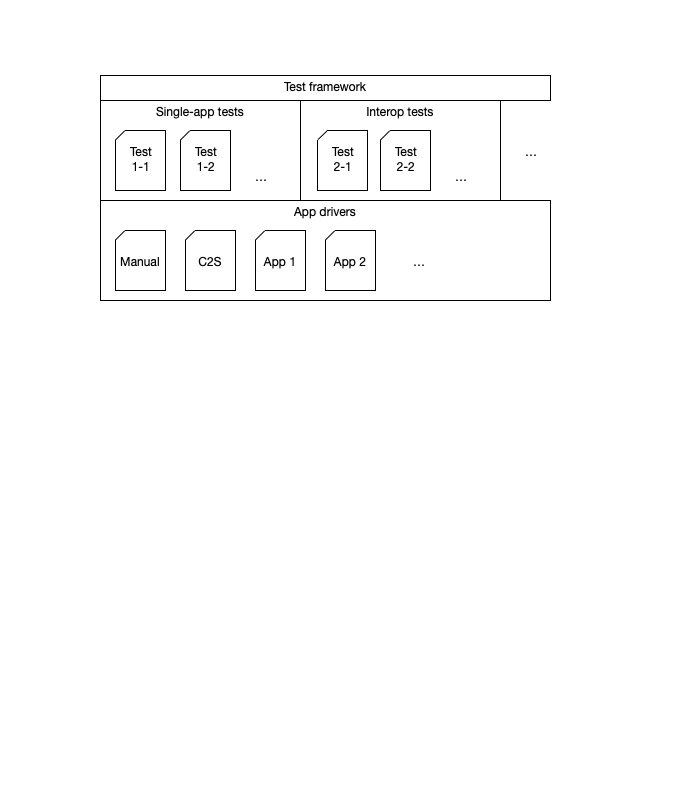

# Planning the Fediverse test suite

## The problem

Core premise of the Fediverse is that users can use any Fediverse servier-side app they
choose (say “App A” such as Mastodon) to interact with others on the Fediverse, even if
they use a different server-side “App B”, and when they do so, the interaction “will work”.
Technically, this means that any two server-side Apps A and B must implement the same
Fediverse protocol stack in compatible ways. (Note: we will use the term "app" to describe
server-side Fediverse apps such as Mastodon. Don't confuse it with mobile apps; we don't
talk about them here.)

In practice, this is difficult, for the following reasons:

1. The relevant protocol stack (centered around
   [ActivityPub](https://www.w3.org/TR/activitypub/), but also including
   [WebFinger](https://datatracker.ietf.org/doc/html/rfc7033),
   [HTTP signatures](https://datatracker.ietf.org/doc/html/draft-cavage-http-signatures)
   and more) is complex; implementation errors are easily made.

1. Many new implementations are being created by development teams with great
   ideas but that are under-resourced; detailed protocol testing against many other apps
   often falls by the wayside due to resource constraints. This creates bad experiences
   for users, diminishing the value of the Fediverse.

1. Several of the relevant standards comprising the technical protocol stack can be
   implemented in a variety of different ways, that – even while staying within the
   boundaries that the standards permit — nevertheless lead to incompatible implementations.

1. As different Fediverse apps tend to have different feature sets (sometimes dramatically
   so; e.g. from microblogging to video sharing and reading list management), different
   apps often implement extensions or conventions for their particular domain, all of
   which need to be at least tolerated by all other Fediverse apps. Without systematically
   testing this, app users may be in for a (bad) surprise.

1. There is a rich set of official and less official Fediverse extensions being created by
   many developers; implementations of those need to at least not conflict with others.

1. The number of Fediverse apps keeps rising from the current several dozen, and is
   expected to continue to rise for the foreseeable future. It is practically impossible for
   developers to manually test their own app against dozens of other apps even today, much
   less in the future.

1. New app releases are frequent; in theory, every app should be tested in all of its
   versions against all versions of all other apps, as it may encounter any of them
   on the Fediverse. In the current state of affairs – manual testing – this is completely
   impossible as the costs in time and effort would be astronomical.

1. There is widespread concern in the community that Fediverse apps with an outsized
   user base will not pay close attention to the underlying standards, under the
   assumption that smaller apps will have to interoperate with them regardless;
   a Fediverse test suite could at least make their non-compliance explicit.

1. Similarly, technology history is full of examples where large commercial interests
   paid lip service to supporting an open protocol and instead used a strategy of subtle
   incompatibilities and extensions to subvert the open standard, and ultimately break
   the promise of interoperability across the respective network. While automated tests
   can only do so much to make this less likely, a Fediverse test suite would make this
   strategy less likely to succeed in the Fediverse due to the resulting, immediate negative
   publicity for the entity embarking on that strategy.

A Fediverse test suite with good coverage could thus significantly contribute to:

* better user experiences, and higher utility due to higher quality of interoperability
  across the Fediverse;

* a stronger appeal and utility of the overall network to more users, and more use cases,
  without being beholden to unaccountable commercial interests;

* higher developer productivity and lower cost, leading to more value for users at
  a lower effort/cost of development;

* a well-tested foundation enables higher-level innovation, while subtle interop
  problems largely prevent it.

## Test suite application areas

In discussions with developers, we found three main "application areas" in which testing
Fediverse apps is advantageous:

1. **To support standards development and evolution**. For example, the editors of the
   ActivityPub specification want to know which aspects of their specifications are
   implemented correctly or incorrectly, and by which app.

   Example question: "Which fraction of apps interpret `as2-partial-time` correctly"?

2. **To automate interoperability and regression tests**. For example, an app
   developer wants to know whether they broke interop with some other app in their
   latest commit.

   Example question: "Did adding this extra value in my `@context` create
   difficulties for users whose friends are on Firefish?"

3. **To interactively enable new developers to quickly and correctly implement the relevant
   protocols so they can create a full-fledged, interoperable Fediverse app as quickly as
   possible**. For example, a new developer may not easily realize that their code encodes
   public keys (needed for HTTP signatures) incorrectly.

   Example question: "I am signing the message as the spec says, but why doesn't it show up
   in Mastodon?"

As the needed technical setup is very different for the interactive application area 3,
this project focuses on supporting standards development and automated regression
testing for developers in application areas 1 and 2.

## Prior work

No comprehensive Fediverse automated test suite is known to us at this time. However, there
is related work available under open-source licenses that we plan to leverage.
(Know some more? File an issue with a pointer.)

* The original "ActivityPub Test Suite" created by Christine Lemmer-Webber in 2017
  ([link](https://gitlab.com/dustyweb/pubstrate/-/blob/master/pubstrate/aptestsuite.scm))
  and its recent port to Python by Steve Bate ([link](https://github.com/steve-bate/rocks-testsuite)).
  Note it is somewhat misnamed: a better name for it might be a "self-assessment
  questionnaire." While potentially useful, it does not address the requirements addressed
  here.

* The "exploratory proof-of-concept" "ActivityPub Test Suite" using Pytest recently created
  by Steve Bate ([link](https://github.com/steve-bate/activitypub-testsuite)). It uses
  a very similar structure to the one proposed here, and will be our point of departure
  for this project.

* The "ActivityPub Protocol Behaviors" collected by the emerging Socialweb.Coop
  here ([link](https://socialweb.coop/activitypub/behaviors/)). We are planning to "feed"
  these behaviors (defined in English) into a process by which they are turned into
  executable tests that we can run (also see below).
  There is a similar list of "Fediverse Features" by Helge
  [here](https://codeberg.org/helge/fediverse-features). An integration of those two
  projects is tbd.

* The interactive test setup for developers created by Helge as part of the Fun Fediverse
  Development project ([link](https://codeberg.org/helge/funfedidev)). This project
  does not appear to address automated regression testing across many apps, and is
  complementary.

## Scope for this project

In the longer term, the test suite should cover all aspects that need testing to ensure
interoperability between the Fediverse apps used in the Fediverse today, and future ones
as they are being developed. Ultimately, the best judge of whether interoperability
between two apps is satisfactory is the user and their interop expectations.

We initially focus on:

* ActivityPub server-to-server interoperability for commonly implemented activities and
  object types (list is tbd);

* Use of `@user@host` identifiers;

* Use of Webfinger to resolve identifiers into ActivityPub actor documents;

* Use of HTTP signatures to authenticate senders and signed fetches;

* Behavior of receiving apps consistent with the intent of the sending app (e.g.
  does the app indeed delete a note, or block a user, if requested; list tbd).

As more implementations become available, we may add support later for:

* ActivityPub client-to-server interoperability.

## Technical approach

### Basic approach

The basic technical approach is to develop a Fediverse test suite:

* That can, in principle, be used with all Fediverse apps;

* That is a single framework from which all tests can be run;

* That contains **“single-app tests”**, meaning tests that run against a single Fediverse app
  (e.g. to check whether the app publishes ActivityPub Actor files correctly);

* That contains **“interop tests”**, meaning tests in which two (and potentially more) apps
  are tested against each other (e.g. to check whether a post made in app A will appear
  in the timeline of a follower using app B without corruption in the payload);

* Where **tests are typically defined independently of the tested app** (e.g. does a post
  made in app A appear in the timeline of a follower using app B, where the test can
  be run with any Fediverse apps in the roles of A and B);

* Where tests can be defined in a **modular** fashion, including by other projects.

* But where it is also possible to add tests that apply only to specific apps, or
  specific combinations of specific apps;

* That has facilities to limit the tests being executed on any run to what is currently of
  interest to the tester;

* That can run “all tests against all known Fediverse apps and all combinations of them”
  at the limit. While it is unlikely that anybody ever would want to do that in one run
  (the effort to do so grows quadratically with the number of apps/app versions), this
  theoretical ability guarantees that the test suite architecture can accommodate any
  subset (such as testing one app against the top-10 others) a tester may be interested in.

* That produces easy-to-understand test reports.

### Architecture overview



### Addressing the challenges of app provisioning, observability and controllability: App Drivers

There are several practical challenges for the test framework in the interaction with specific apps:

**App provisioning:** Ideally, to run a series of tests against app A, a clean new instance of app
A without older data should be provisioned for the duration of the test run, and taken down
afterwards. This would:

* Keep test data and test-related load away from production servers;

* Avoid that tests run simultaneously by two different developers can interfere with each
  other if they were to run on the same test instance;

* Enable developers to debug apps while running tests, to determine the source of an error
  (e.g. to set breakpoints, or add debug logging code).

**Observability:** automated tests need to have the ability to observe whether the state
of an app instance indeed changed in response to a test as intended. Such state changes
may not always be observable on publicly accessible HTTP endpoints, and even if observable,
the location of the change may different dramatically by app, creating observability
challenges for the test framework. (E.g. did a private message arrive?)

**Controllability:** automated tests need to have the ability to make an app “do something”,
such as make a particular post with a particular media attachment. What actions are
possible and how they can be taken also depends highly on the app, creating controllability
challenges for the test framework.

We address those challenges with the notion of an **“App Driver”**.

The App Driver is an abstract programming interface that, in principle, is implemented once
for each covered app. It defines methods for the above functionality, such as:

* Provisioning-related methods:

  * Provision a clean new instance of the app, and return its root URL.

  * Deprovision an app instance.

  * Provision an account on the instance.

  * Deprovision an account.

  * Set the instance to use a known data set.

* Observability-related methods, e.g. such as:

  * Is post X there?

  * Has user Y been blocked?

  * Etc.

* Controllability-related methods, e.g. cause the app to:

  * Create a post.

  * Delete a post.

  * Edit a post.

  * Follow an account.

  * Etc.

There will be a default implementation for the App Driver interface, which is “manual”. This
default implementation merely tells the tester what operation to perform manually, and what
result to observe and enter manually. This manual App Driver can be used with any app,
but obviously requires lots of human effort to operate.

App Drivers for apps may choose to implement a combination of fully automated and manual.

App Drivers are most naturally implemented by the developer of the respective app.
Depending on the app, App Drivers may be implemented using virtual machines, Docker,
local installation, or (dedicated or shared) cloud services.

### Plugins

Not every tester may be interested in every test case, or App Driver. Some App Drivers
(e.g. those using certain virtualization platforms)
may not even run on a given tester's development machine. So we will make use of a
"plugin" architecture (loose analogy: WordPress plugins) for the test framework.

The test framework is the main project, with "plugins packages" that contain:

* Groups of tests. For example, one "tests plugin package" might be the set of tests that
  officially tests ActivityPub standards compliance. This group of tests may be maintained by
  a W3C-chartered group.

* A specific App Driver, such as code that knows how to run Firefish locally in a Docker
  container. That would be an App Driver plugin package.

* Developers can choose to use this test frame for defining their own, project-specific
  single-app or interop tests. They should be able to simply "plug in".

Python already has some documented conventions how to manage
[plugins](https://packaging.python.org/en/latest/guides/creating-and-discovering-plugins/),
which we plan to use.

### Capabilities

Different Fediverse apps have different capabilities, such as microblogging vs. image
sharing. As a result, not all tests will be applicable to all Fediverse apps.

Steve Bate's testsuite project (see above) already has the notion of capabilities for an
app, which we will continue to use for categorizing apps and tests, so only applicable
tests will be run for specific apps.

## Organizational approach

### Process

The process by which tests are defined and broadly agreed on may likely turn out to be complex.
This is because:

* Real-world implementations of the Fediverse protocols, including by the leading projects,
  are implementing only a narrow subset of what is permitted in the relevant standards,
  while simultaneously relying on significant extensions.

* In a decentralized network such as the Fediverse, a single authority that can define what
  is and isn't correct behavior does not (and perhaps should not) exist.

As a result, we foresee a significant process through which test cases are defined and
ultimately implemented. This is shown in the next figure:


While the details of the process will only become clear once we attempt to execute it, we expect that
there will be a significant discussion period between when the need for an additional test is identified
by somebody until the test is coded and made official part of the test suite. This is
particularly true for tests that are candidates for the group of official conformance
tests. (Though our plugin architecture, however, test can more easily be coded and added in a
less "official" plugin first.)

### Towards a collaborative project with broad support

Organizationally, the test suite will be structured in a way that it is easy for
developers from any existing or new Fediverse app A:

* To add support for their app A in the test suite, so it can be used:

  * To test their own app A;

  * By developers of other Fediverse apps B to test against app A.

* To add new test cases that can be run not only against their own app B, but also by
  other developers for configurations that do not involve app A at all. (Example: the
  developer of an app A may discover that posts they receive that contains content using the cyrillic
  alphabet get mangled in their app, so they define an extra test case for their own app;
  this test case should now also be usable by developers of other apps)

So we foresee a single Fediverse test suite that becomes a collaborative endeavor of many
Fediverse developers, all of whom have an incentive to contribute to a single test suite
with broad coverage (in terms of tests, and in terms of covered apps) and shared effort
to keep it up-to-date.

This is best accomplished by making the test suite a well-functioning open-source
project with many contributors under a neutral organizational framework such as the
emerging Fediverse Developers Network.

## Other outcomes

Beyond the direct benefits of having automated tests (such as higher software quality,
fewer regressions, fewer frustrations for the user), we anticipate some potential
additional, indirect benefits:

* The definition of test cases makes interoperability choices transparent where apps
  with different capabilities interoperate. (Example: what is the “correct” behavior for an
  app receiving richly formatted text if the receiving app does not actually support
  richly formatted text, or how, say, event invitations should show up in a microblogging
  app?) Once transparent, an easier discussion can be had about how this impacts user
  expectations and experience, and what the “best” behavior actually is.

* It opens up the possibility of a potential Fediverse conformance program, potentially
  leading to a “Interoperates with the Fediverse” logo / certification mark that could
  help reduce user confusion, like similar programs do in other industries. (Many
  questions would have to be answered before any such thing can be accomplished;
  including, for example, the question of “interop profiles”.)

## Tester experience (straw proposal)

To illustrate how a tester might interact with the test suite, consider the following.
Note this is a straw proposal for illustrative purposes only:

### Setup

```
> git clone https://github.com/fediverse-devnet/feditest.git
> cd feditest
```

### Test runs

```
> feditest run —single —app mastodon –all
```

This would run all tests that can be run against app Mastodon without involving another app.

```
> feditest run —interop —app mastodon –all
```

This would run all interoperability tests involving app Mastodon against all other supported apps.

```
> feditest run —interop —app mastodon –app pixelfed –filter media\*
```

This would run all interoperability tests between apps Mastodon and Pixelfed that involve media.

At the (practically probably infeasible) limit:

```
> feditest run –all
```
This would run all known tests against all apps in all combinations.

Reports would look something like this:

```
Report:
…
ERROR: app X: does not publish outbox in Actor file
WARNING: Threads->Lemmy: post in cyrillic alphabet arrived with mangled characters
…
```

### Other

```
> feditest list-tests
```

Shows all available tests.

```
> feditest list-tests –app lemmy
```

Shows all available tests for app lemmy.

